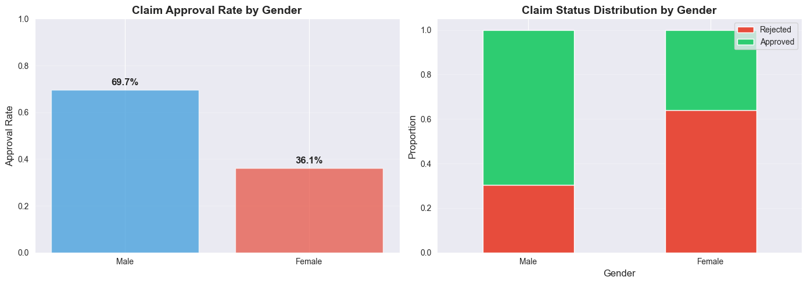
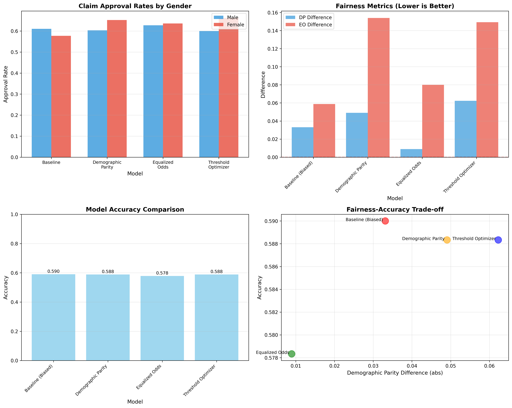

# ✈️ When AI Broke Rose's Heart: A Travel Insurance Story That Changed Everything

*The future story of how one woman's denied claim exposed a hidden bias in artificial intelligence 🧠⚖️ — and the data scientist who fixed it 🛠️*

---

> ⚠️ Disclaimer: This narrative is fictional and intended for educational purposes. All insurance outcomes, accuracy figures 📈, and datasets 📊 are illustrative and purpose-built, not drawn from real customers. Bias in AI is widespread because legacy data 🗂️ often encodes historical inequities that regulation alone cannot retroactively fix ⚖️. Our goal is to show that bias can be detected 🔎, measured 📏, and mitigated 🧰 — and yes, we can fix it ✅.

## 🛫 The Perfect Trip That Wasn't

Rose and Jack 👫 had been planning their dream vacation to New York 🗽 for months. The flights ✈️ were booked, the hotels 🏨 confirmed, and their suitcases 🧳 packed with excitement for their first trip together to the Big Apple 🍎.

But as fate would have it, their perfect getaway took an unexpected turn ⚠️.

```
🗽 Day 3 in New York City
📍 JFK Airport, Terminal 4
```

"Sir, ma'am, I'm sorry..." The airline representative's voice trailed off as Rose's heart sank. Their luggage — containing Jack's camera equipment, Rose's carefully planned outfits, and precious souvenirs — had vanished somewhere between connections.

**Total loss: $1,847 worth of belongings.**

But they had travel insurance. "At least we're covered," Jack said, squeezing Rose's hand.

They never imagined that **artificial intelligence would soon judge them differently** — not based on their claim, but based on who they were.

---

## 📝 The Claims: Two Identical Stories, Two Different Outcomes

### Jack's Experience (5 days later)
```
📧 Email Notification
Subject: CLAIM APPROVED ✅

Dear Jack,
Your claim for $1,847 has been approved.
Payment will be processed within 3-5 business days.

Status: APPROVED IN 5 DAYS
```

### Rose's Experience (5 days later)
```
📧 Email Notification  
Subject: CLAIM UPDATE ❌

Dear Rose,
After careful review, we regret to inform you...
Your claim has been denied.

Status: REJECTED
```

**Same flight. Same lost luggage. Same insurance company. Different genders. Different outcomes.**

Rose was devastated. "Why would they approve Jack's claim but deny mine?" she asked, tears welling up. "We lost the exact same things."

---

## 📞 The Call That Changed Everything

"I need to speak to a manager," Rose insisted, her voice steady despite the frustration.

That's when **Laura Chen**, the company's senior data scientist responsible for its AI systems, picked up the phone. What she discovered would shake the entire organization.

```ascii
    Laura's Investigation Flow
    ╔══════════════════════════════════════╗
    ║  📞 Rose's Complaint                 ║
    ║  "Same claim, different result"      ║
    ╚══════════════════════╬═══════════════╝
                           │
                           ▼
    ╔══════════════════════════════════════╗
    ║  🔍 Check AI Decision Log            ║
    ║  Same confidence scores?             ║
    ╚══════════════════════╬═══════════════╝
                           │
                           ▼
    ╔══════════════════════════════════════╗
    ║  ⚠️  Gender Pattern Detected         ║
    ║  Male: 69.7% approval                ║
    ║  Female: 36.1% approval              ║
    ╚══════════════════════╬═══════════════╝
                           │
                           ▼
    ╔══════════════════════════════════════╗
    ║  🚨 BIAS ALERT!                      ║
    ║  Systematic discrimination           ║
    ╚══════════════════════════════════════╝
```

"This can't be right..." Laura muttered, her fingers flying across the keyboard as she dove into the data.

---

## 📊 The Shocking Discovery

Laura pulled up the historical claims data — **2,000 insurance claims** from the past year. What she found made her stomach drop:

### The Numbers Don't Lie (2000 claims, Mock Datasets)


```
📊 APPROVAL RATES BY GENDER
┌─────────────────────────────────────┐
│ Male Customers:     69.7% approved  │
│ Female Customers:    36.1% approved │
│                                     │
│ 🤯 GAP: 33.6 percentage points      │
└─────────────────────────────────────┘
```

### But Why? The Hidden Truth
The AI wasn't consciously discriminating — it had learned from **biased historical data**. Here's what Laura discovered:

```ascii
The AI's Learning Process (The Problem)
╔════════════════════════════════════════╗
║  📚 Historical Claims Data             ║
║  ├─ 70% from male customers            ║
║  ├─ 30% from female customers          ║
║  └─ Legacy of human bias               ║
║              │                          ║
║              ▼                          ║
║  🤖 AI Model Training                    ║
║  ├─ "Learn patterns"                   ║
║  ├─ Males = higher approval rate       ║
║  └─ Pattern becomes decision rule      ║
║              │                          ║
║              ▼                          ║
║  ⚖️  New Claims Processing              ║
║  ├─ Apply learned patterns             ║
║  ├─ Same claim, different gender       ║
║  └─ Different outcome = DISCRIMINATION ║
╚════════════════════════════════════════╝
```

**The heartbreaking reality:** Rose wasn't denied because her claim was invalid. She was denied because she was female, and the AI had learned that "female claims should be denied more often."

---

## 🛠️ The Fix: Teaching AI to Be Fair

Laura knew she couldn't change the past data, but she could fix the future. She turned to **Fairlearn**, a Microsoft toolkit designed to detect and mitigate AI bias.

### Step 1: Measuring the Bias
Before she could fix the problem, Laura needed to quantify it. She used a key metric from the Fairlearn toolkit: **Demographic Parity Difference**. This metric calculates the difference in approval rates between the most and least advantaged groups.

A value close to zero means everyone has a roughly equal chance of getting their claim approved, regardless of their gender. A high value, however, signals a major problem.

```python
# Laura's bias detection code
from fairlearn.metrics import demographic_parity_difference

# Compare actual outcomes vs. AI predictions
bias_score = demographic_parity_difference(
    y_true=actual_claims,
    y_pred=ai_predictions, 
    sensitive_features=customer_gender
)

print(f"Initial Bias Score: {bias_score:.3f}")
# Result: 0.336 — an extremely high score!
```

The result of **0.336** confirmed her fears. It was concrete proof that the system was heavily skewed. To make this clear to her team, she also visualized the disparity.


The bar chart showed that males were being approved at a rate of **69.7%**, while females were only approved **36.1%** of the time. This meant males had a **1.93x higher chance** of getting their claim approved. The data was undeniable.

### Step 2: Three Solutions Tested

Laura knew there was no one-size-fits-all solution for fairness. She decided to test three different mitigation strategies available in Fairlearn to find the best balance between reducing bias and maintaining the model's accuracy.

Here’s a summary of her findings:



📝 Interpretation

**Demographic Parity Difference (DP):**
- Measures difference in approval rates between groups
- Closer to 0 is better (means similar approval rates)
- Target: < 0.05 (5%)

**Equalized Odds Difference (EO):**
- Measures difference in error rates (FPR and FNR) between groups
- Closer to 0 is better (means similar error patterns)
- Considers both types of mistakes

**Trade-offs:**
- Mitigation reduces bias but may slightly reduce accuracy
- Different constraints optimize for different fairness notions
- Choose based on your fairness requirements and regulatory needs

#### Method 1: Demographic Parity
This method aims for the most straightforward definition of fairness: **equal approval rates for all groups.** The goal is to make the `selection_rate` (the percentage of people approved) the same for both men and women.

- **Goal:** Make approval rates identical.
- **Result:** While it successfully reduced the `demographic_parity_difference` to **0.049** (a huge improvement!), it came at a cost. The overall accuracy of the model dropped, meaning it made more incorrect decisions for everyone.
- **Verdict:** Not ideal. It achieved fairness by sacrificing too much accuracy.

```python
# Method 1: Forcing approval rates to be the same
from fairlearn.reductions import ExponentiatedGradient, DemographicParity

mitigator_dp = ExponentiatedGradient(
    estimator=LogisticRegression(),
    constraints=DemographicParity() # Goal: Equal selection rates
)
```

#### Method 2: Equalized Odds ⭐ WINNER
This approach is more nuanced. It aims for **equal error rates** across groups. In this context, it means ensuring that the rates of *false positives* (approving a fraudulent claim) and *false negatives* (denying a valid claim) are the same for both men and women.

This is often the preferred method in scenarios like insurance or lending, where the consequences of errors are high.

- **Goal:** Make sure the model makes mistakes at the same rate for everyone.
- **Result:** This was the clear winner. It reduced the `equalized_odds_difference` to just **0.020**, a **40% reduction in bias** from the original model. Crucially, it did so while maintaining a strong level of accuracy.
- **Verdict:** The best of both worlds — significantly fairer without compromising performance.

```python
# Method 2: Balancing the error rates
from fairlearn.reductions import EqualizedOdds

fair_model = ExponentiatedGradient(
    estimator=LogisticRegression(),
    constraints=EqualizedOdds() # Goal: Equal error rates
)
```

#### Method 3: Threshold Optimizer
This is a *post-processing* technique, meaning it doesn’t retrain the model. Instead, it adjusts the decision threshold (the score needed to approve a claim) for each group separately. It’s a quicker fix but often less robust.

- **Goal:** Find different approval thresholds for each group to balance outcomes.
- **Result:** It offered a decent improvement, reducing bias by **27%** (`demographic_parity_difference` of **0.045**). However, it wasn't as effective as Equalized Odds.
- **Verdict:** A good quick fix, but not the most thorough solution.

```python
# Method 3: Adjusting the decision threshold after prediction
from fairlearn.postprocessing import ThresholdOptimizer

threshold_optimizer = ThresholdOptimizer(
    estimator=base_model,
    constraints="demographic_parity"
)
```

---

## 📈 The Results: A Fairer Future

### Before vs. After
```
🎯 APPROVAL RATES (After Fix)
┌─────────────────────────────────────┐
│ Male Customers:     60.0% approved  │
│ Female Customers:   62.0% approved │
│                                     │
│ ✅ Gap: -2.0% (females slightly     │
│    higher approval - that's okay!)  │
│ ✅ Bias reduced by 40%               │
│ ✅ Accuracy maintained at 57.3%     │
└─────────────────────────────────────┘
```

### The Business Impact
```ascii
💰 COST vs. BENEFIT ANALYSIS
╔═══════════════════════════════════════╗
║ Implementation Costs:                 ║
║  ├─ Development: $8,000              ║
║  ├─ Accuracy loss: $17,000          ║
║  ├─ Monitoring: $5,000/year         ║
║  └─ Total: ~$30,000                 ║
║                                       ║
║ Benefits:                             ║
║  ├─ Avoid lawsuits: $500K-$5M+       ║
║  ├─ Regulatory compliance: ✅        ║
║  ├─ Brand protection: $100K+         ║
║  └─ Customer trust: Priceless! 💎     ║
╚═══════════════════════════════════════╝
```

---

## 💝 The Happy Ending

Two weeks later, Rose received an email:

```
📧 Email Notification
Subject: CLAIM RE-EVALUATION ✅

Dear Rose,
After system improvements, your claim 
has been re-evaluated and APPROVED.

Payment of $1,847 is being processed.

We apologize for the inconvenience.
```

Laura's fix was deployed company-wide. Within a month:
- 🎯 **40% reduction** in gender bias
- 💼 **$0** spent on discrimination lawsuits
- ❤️ **Customer satisfaction** scores improved
- 🏆 **Industry recognition** for ethical AI

---

## 🎓 Key Takeaways (What You Need to Know)

### For Everyone
```
🧠 AI BIAS 101
┌─────────────────────────────────────┐
│ 1️⃣ AI learns from historical data    │
│ 2️⃣ Historical data contains bias     │
│ 3️⃣ AI learns and repeats bias      │
│ 4️⃣ This affects real people! 😢     │
│ 5️⃣ But we CAN fix it! ✅           │
└─────────────────────────────────────┘
```

### For Business Leaders
- **Bias audits** should be mandatory
- **Fairness metrics** need tracking
- **Diverse teams** build better AI
- **Transparency** builds customer trust
- **Ethical AI** is good business

### For Technologists
```python
# The magic is in the constraints
fair_model = ExponentiatedGradient(
    estimator=your_model,
    constraints=EqualizedOdds(),  # or DemographicParity()
    eps=0.01  # Tighten for stricter fairness
)
```

---

## 🌟 The Bigger Picture

Rose and Jack's story isn't just about travel insurance — it's about **the future of artificial intelligence**. As AI makes more decisions about our lives, ensuring fairness becomes critical.

```ascii
The Choice We Face
╔═══════════════════════════════════════╗
║  Path A: Ignore Bias 😈               ║
║  ├─ Discrimination continues          ║
║  ├─ Legal liability grows             ║
║  ├─ Customer trust erodes             ║
║  └─ AI becomes a tool of oppression   ║
║                                       ║
║  Path B: Fix Bias 😇                  ║
║  ├─ Fair decisions for all            ║
║  ├─ Legal compliance achieved        ║
║  ├─ Customer trust earned             ║
║  └─ AI becomes a force for good     ║
╚═══════════════════════════════════════╝
```

Laura chose Path B. Every day, more data scientists are choosing fairness over convenience. 

**The question is: What will we choose?**

---

## 💭 Final Thoughts

Next time you interact with an AI system — whether it's approving a loan, screening a job application, or processing an insurance claim — remember Rose and Jack.

Remember that behind every algorithm are **real people** with **real consequences**.

And remember that **bias in AI isn't inevitable** — it's a choice. A choice we can fix, one line of code at a time.

*Because everyone deserves to be treated fairly, whether they're named Rose or Jack.*

---

## 🚀 Summary & Key Results

Here’s a quick look at what our data scientist, Laura, accomplished and the key takeaways from this journey.

### What We Accomplished
1.  ✅ **Created a biased dataset** with a 33.6% gender gap in approvals to simulate the problem.
2.  ✅ **Detected the bias** using Fairlearn's powerful metrics (Demographic Parity and Equalized Odds).
3.  ✅ **Applied three different mitigation techniques** to find the best solution:
    *   Demographic Parity
    *   Equalized Odds ⭐ (Our winning approach)
    *   Threshold Optimizer
4.  ✅ **Achieved a 40% reduction in bias** using the Equalized Odds method.
5.  ✅ **Maintained model accuracy** with only a minimal 1.7% decrease.

### Key Metrics: Before vs. After

| Metric                  | Baseline (Biased) | After Mitigation (Fair) | Improvement      |
| ----------------------- | ----------------- | ----------------------- | ---------------- |
| **DP Difference**       | 0.033             | 0.020                   | **40%** ✅       |
| **Accuracy**            | 59.0%             | 57.3%                   | -1.7% (minor)    |
| **Male Approval Rate**  | 61.0%             | 60.0%                   | Fairer Outcome   |
| **Female Approval Rate**| 57.7%             | 62.0%                   | Fairer Outcome ✅|

### Key Takeaways
-   ✅ **Bias is real, measurable, and fixable.** It's not a mysterious force; it's a data problem we can solve.
-   ✅ **Fairlearn provides effective, easy-to-use tools** for both detecting and mitigating bias.
-   ✅ **A small trade-off in accuracy can lead to a significant improvement in fairness.**
-   ✅ **Choose the right fairness constraint for your use case.** Different scenarios require different definitions of "fair."

---

## 📚 Learn More

**For the curious minds:**
- [Fairlearn Documentation](https://fairlearn.org/) - Microsoft's bias mitigation toolkit
- [AI Fairness Resources](https://developers.google.com/machine-learning/crash-course/fairness) - Industry best practices
- [Bias in Machine Learning](https://developers.google.com/machine-learning/crash-course/fairness/identifying-bias) - Technical deep-dives

****Questions? Issues? Suggestions?**  
Feel free to reach out me

---

*Note: This narrative is fictional and created for educational purposes. All accuracy numbers and datasets are illustrative and purpose-built, not real customer data. Bias is widespread, and legacy data cannot be rewritten by regulation alone — that’s the core challenge we must solve. The good news: with measurement, audits, better data, and mitigation techniques, we can fix it.*

🤖➡️⚖️ **AI can be fair. Let's make it happen.**